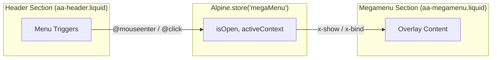
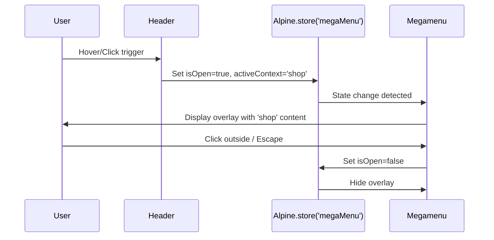

# Design Document: Megamenu Decoupling

## Overview

This document describes the technical design for decoupling the megamenu from the Shopify header section. The root cause of the current malfunction is that the megamenu lives inside the `<header>` element, which Shopify's native JavaScript can regenerate—destroying Alpine.js state and causing unstable open/close behavior.

The solution creates a clear architectural boundary:
- **Header**: Acts as a simple trigger (emits events, updates store)
- **Megamenu**: Lives outside the header, rendered independently, controlled by a global Alpine store



---

## Architecture

### Component Separation

| Component | Location | Role | Alpine Scope |
|-----------|----------|------|--------------|
| Header | `sections/aa-header.liquid` | Trigger only, no dropdown DOM | Local `x-data` for burger |
| Megamenu Store | `assets/megamenu-store.js` | Global state | `Alpine.store('megaMenu')` |
| Megamenu Overlay | `sections/aa-megamenu.liquid` | Independent overlay | Consumes `$store.megaMenu` |

### Data Flow



---

## Components and Interfaces

### 1. Megamenu Store (`assets/megamenu-store.js`)

Follows the pattern established by `cart-store.js`:

```javascript
// assets/megamenu-store.js
document.addEventListener("alpine:init", () => {
  Alpine.store("megaMenu", {
    isOpen: false,
    activeContext: null,
    closeTimeout: null,

    open(context) {
      clearTimeout(this.closeTimeout);
      this.isOpen = true;
      this.activeContext = context;
    },

    close() {
      this.isOpen = false;
      this.activeContext = null;
    },

    // Debounced close for hover-out
    scheduleClose(delayMs = 300) {
      this.closeTimeout = setTimeout(() => {
        this.close();
      }, delayMs);
    },

    cancelClose() {
      clearTimeout(this.closeTimeout);
    }
  });
});
```

### 2. Header Triggers (`sections/aa-header.liquid`)

Modify the header to emit events instead of rendering dropdowns:

```liquid
 Navigation Links (Desktop) 
<div class="b-navbar-start">
  
    
       TRIGGER ONLY - no dropdown rendered here 
      <a
        href="{{ link.url }}"
        class="b-navbar-item b-navbar-link b-is-size-6"
        @mouseenter="$store.megaMenu.open('{{ link.handle }}')"
        @mouseleave="$store.megaMenu.scheduleClose()"
        @click.prevent="$store.megaMenu.open('{{ link.handle }}')"
        :class="{ 'is-active': $store.megaMenu.activeContext === '{{ link.handle }}' }"
      >
        {{ link.title }}
        <span class="b-icon b-is-small">▼</span>
      </a>
    
      <a href="{{ link.url }}" class="b-navbar-item b-is-size-6">
        {{ link.title }}
      </a>
    
  
</div>
```

### 3. Megamenu Overlay (`sections/aa-megamenu.liquid`)

New independent section rendered after the header:

```liquid

  aa-megamenu.liquid - Independent Megamenu Overlay
  Decoupled from header, controlled by Alpine.store('megaMenu')




<div
  x-data
  x-show="$store.megaMenu.isOpen"
  x-cloak
  x-transition:enter="transition ease-out duration-200"
  x-transition:enter-start="opacity-0 transform -translate-y-2"
  x-transition:enter-end="opacity-100 transform translate-y-0"
  x-transition:leave="transition ease-in duration-150"
  x-transition:leave-start="opacity-100"
  x-transition:leave-end="opacity-0"
  @mouseenter="$store.megaMenu.cancelClose()"
  @mouseleave="$store.megaMenu.scheduleClose()"
  @keydown.escape.window="$store.megaMenu.close()"
  @click.outside="$store.megaMenu.close()"
  class="aa-megamenu-overlay"
  role="navigation"
  aria-label="Megamenu navigation"
>
  <div class="b-container">
    
      
        <div
          class="aa-megamenu-panel"
          x-show="$store.megaMenu.activeContext === '{{ link.handle }}'"
        >
          <div class="b-columns b-is-multiline">
            
              <div class="b-column b-is-3">
                <p class="b-menu-label">{{ child.title }}</p>
                
                  <ul class="b-menu-list">
                    
                      <li><a href="{{ grandchild.url }}">{{ grandchild.title }}</a></li>
                    
                  </ul>
                
                  <a href="{{ child.url }}" class="b-button b-is-text">View All</a>
                
              </div>
            
          </div>
        </div>
      
    
  </div>
</div>
```

---

## Data Models

### Megamenu Store State

| Property | Type | Default | Description |
|----------|------|---------|-------------|
| `isOpen` | boolean | `false` | Whether megamenu is visible |
| `activeContext` | string \| null | `null` | Handle of the active parent menu item |
| `closeTimeout` | number \| null | `null` | Timeout ID for debounced close |

### Menu Link Structure (Shopify Liquid)

The existing Shopify menu structure is consumed:

```
menu.links[] → Parent items (Shop, Collections, etc.)
  └── link.links[] → Second level (Categories)
      └── child.links[] → Third level (Subcategories)
```

---

## Error Handling

### Alpine Store Not Initialized

```javascript
// Defensive check in megamenu overlay
x-data="{ 
  get isReady() { 
    return typeof Alpine !== 'undefined' && $store.megaMenu !== undefined 
  } 
}"
x-show="isReady && $store.megaMenu.isOpen"
```

### Missing Menu Data

```liquid

   Silent fail - no megamenu rendered 

```

### Close on Navigation

```javascript
// In megamenu-store.js
document.addEventListener('turbo:before-visit', () => {
  Alpine.store('megaMenu')?.close();
});
```

---

## Testing Strategy

### Automated Tests

#### Unit Test: Megamenu Store (`src/tests/megamenu-store.test.js`)

```bash
npm run test -- src/tests/megamenu-store.test.js
```

Tests:
- Store initializes with correct defaults
- `open(context)` sets `isOpen=true` and `activeContext`
- `close()` resets state
- `scheduleClose()` triggers close after delay
- `cancelClose()` prevents scheduled close

#### CSS Validation

```bash
npm run build:css
```

Ensures megamenu SCSS compiles without errors.

### Manual Verification

| Test Case | Steps | Expected Result |
|-----------|-------|-----------------|
| Desktop hover | 1. Open dev server<br>2. Hover "Shop" in header | Megamenu opens with Shop content |
| Desktop debounce | 1. Hover trigger<br>2. Move to megamenu within 300ms | Megamenu stays open |
| Desktop escape | 1. Open megamenu<br>2. Press Escape | Megamenu closes |
| Mobile tap | 1. Resize to <1024px<br>2. Tap menu item | Drawer/accordion opens |
| State persistence | 1. Open megamenu<br>2. Trigger Shopify DOM refresh<br>3. Check megamenu | Megamenu state persists |
| Console errors | 1. Open DevTools Console<br>2. Navigate with megamenu | No JS errors |

**Dev Server Command:**
```bash
shopify theme dev --store asgiti-0w
```

---

## Proposed Changes

### [NEW] [megamenu-store.js](file:///home/alejandro/shopify/custom_trade_shopify_theme/assets/megamenu-store.js)

Create Alpine store for megamenu state management:
- `isOpen`, `activeContext`, `closeTimeout` properties
- `open()`, `close()`, `scheduleClose()`, `cancelClose()` methods

---

### [NEW] [aa-megamenu.liquid](file:///home/alejandro/shopify/custom_trade_shopify_theme/sections/aa-megamenu.liquid)

Create independent megamenu section:
- Positioned outside header using `position: fixed`
- Consumes `$store.megaMenu` for visibility
- Renders menu content with Bulma grid (`b-columns`)
- Includes transitions and accessibility attributes

---

### [MODIFY] [aa-header.liquid](file:///home/alejandro/shopify/custom_trade_shopify_theme/sections/aa-header.liquid)

Modify header to act as trigger only:
- Remove dropdown DOM from navigation items
- Add `@mouseenter`, `@mouseleave`, `@click` handlers to triggers
- Use `:class` binding for active state indication

---

### [MODIFY] [header-group.json](file:///home/alejandro/shopify/custom_trade_shopify_theme/sections/header-group.json)

Add megamenu section to header group:
- Include `aa-megamenu` after `aa-header` in order array

---

### [MODIFY] [theme.liquid](file:///home/alejandro/shopify/custom_trade_shopify_theme/layout/theme.liquid)

Add megamenu store script:
- Load `megamenu-store.js` with `defer` before `alpine-bundle.js`

---

### [MODIFY] [megamenu.scss](file:///home/alejandro/shopify/custom_trade_shopify_theme/src/bulma/sass/extensions/megamenu.scss)

Add overlay-specific styles:
- `.aa-megamenu-overlay` with `position: fixed`, `z-index: 100`
- Desktop and mobile specific layouts
- Transition utilities

---

## Verification Plan

### Automated Tests

1. **Unit Tests** (megamenu store logic):
   ```bash
   npm run test -- src/tests/megamenu-store.test.js
   ```

2. **CSS Build Verification**:
   ```bash
   npm run build:css
   ```

### Manual Verification

Run the development server and perform the following checks:

```bash
shopify theme dev --store asgiti-0w
```

1. **Desktop Hover Test**: Navigate to homepage, hover over menu items with submenus. Verify megamenu opens below header.

2. **Debounce Test**: Hover trigger → move cursor to megamenu → confirm it stays open.

3. **Escape Key Test**: Open megamenu → press Escape → confirm it closes.

4. **Click Outside Test**: Open megamenu → click on page body → confirm it closes.

5. **Mobile Test**: Resize browser to <1024px, tap menu item, verify drawer/accordion opens.

6. **Console Check**: Open browser DevTools, navigate with megamenu, verify zero JS errors.

7. **Header Functionality**: Verify logo, search, account, cart icons still work correctly.
