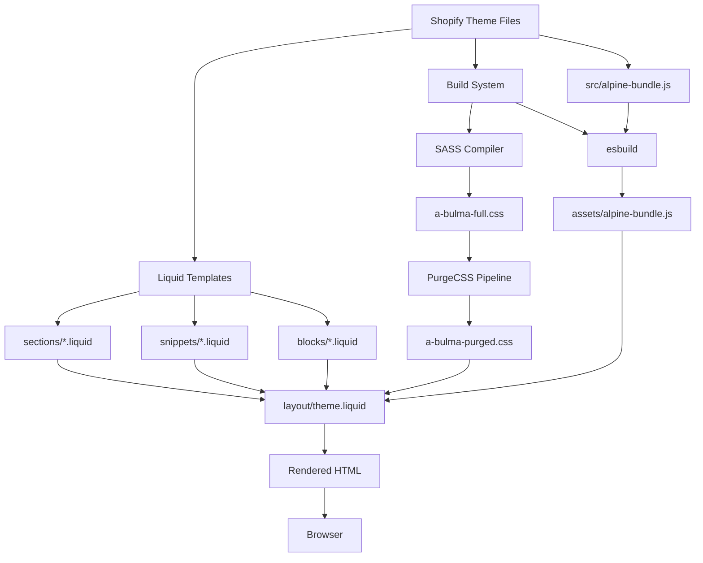
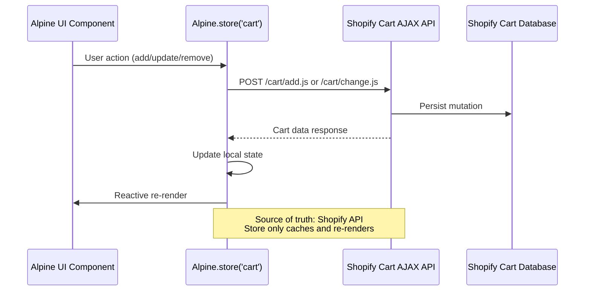
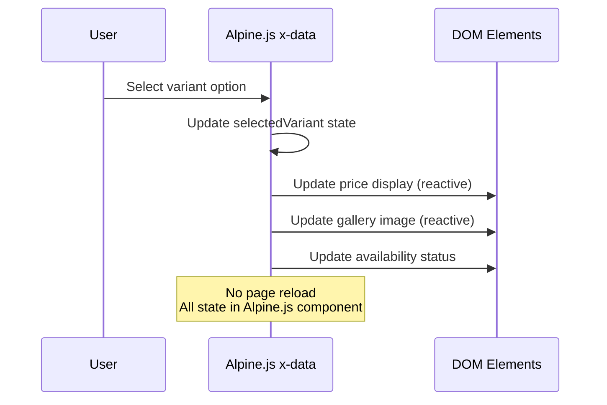

# Design Document

## Overview

This document defines the technical architecture and implementation strategy for migrating the PlayLoveToys Shopify theme from a hybrid Dawn/b-Bulma-Alpine stack to a pure **b-Bulma-Alpine** architecture. The migration will be executed incrementally across 7 phases to maintain store functionality while systematically eliminating legacy code and optimizing performance.

### Current State Analysis

The theme currently exists in a hybrid state:

**Assets Structure:**
- **Legacy CSS:** `base.css`, `component-*.css` (Dawn framework)
- **Modern CSS:** `a-bulma-full.css` / `a-bulma-purged.css` (Bulma with `b-` prefix)
- **Legacy JS:** `global.js`, `cart.js`, `product-form.js`, `details-disclosure.js`
- **Modern JS:** `alpine-bundle.js` (Alpine.js with plugins), `cart-api.js`, `cart-store.js`

**Build Pipeline:**
- SASS compilation: `src/bulma/bulma.scss` → `assets/a-bulma-full.css`
- PurgeCSS: Extracts safelist from Liquid files, purges unused classes → `assets/a-bulma-purged.css`
- Alpine bundling: `src/alpine-bundle.js` → esbuild → `assets/alpine-bundle.js`

**Problems Being Solved:**
1. **Double Loading:** Theme loads both Dawn and Bulma CSS, causing specificity conflicts
2. **Performance Degradation:** Hundreds of unused CSS rules and redundant JS
3. **Maintenance Burden:** Two parallel styling systems requiring dual maintenance
4. **Inconsistent UX:** Mixed usage of vanilla JS and Alpine.js for interactions

### Target Architecture

**CSS Framework:**
- Single source of truth: Bulma CSS (v1.0.4) with custom extensions in `src/bulma/sass/custom/`
- All classes prefixed with `b-` for namespace isolation
- Purged CSS for production, full CSS for development/theme editor
- Custom theming via SASS variables (PLT purple, pink, teal color scheme)

**JavaScript Framework:**
- Alpine.js (v3.15.1) as the sole interactivity layer
- Alpine plugins: `@alpinejs/collapse`, `@alpinejs/intersect`, `@imacrayon/alpine-ajax`
- Global Alpine Store for cart state management
- Custom Alpine data components for product cards and carousel

**Asset Strategy:**
- Images: Shopify `image_tag` filter with lazy loading, explicit dimensions
- Aspect ratio containers: `b-image b-is-1by1`, `b-image b-is-2by1`
- Mobile-first responsive design using Bulma breakpoints

---

## Architecture

### System Architecture



### Migration Phases Architecture

Each phase operates in **coexistence mode** until Phase 7:

1. **Phases 1-6:** New `aa-*` / `c-*` sections/snippets coexist with legacy sections
2. **Layout wrapper:** Migrated components wrapped in `<div class="b-scope">` to isolate from legacy CSS
3. **Template references:** JSON templates updated to point to new sections as migration proceeds
4. **Phase 7:** Legacy assets removed, `b-scope` wrappers eliminated

### Data Flow

**Cart State Management:**


**Product Variant Selection:**


---

## Components and Interfaces

### Core Component Library

#### 1. Foundation Components

##### 1.1 Layout (`layout/theme.liquid`)

**Current Implementation:**
- Lines 31-286: Inline CSS variables for Dawn theme settings
- Line 288: `{{ 'base.css' | asset_url | stylesheet_tag }}`
- Lines 342-349: Conditional Bulma CSS loading (full vs. purged)
- Line 360: Alpine bundle loading

**Migration Actions:**
- **Remove:** Inline `:root` CSS variables (lines 31-212) that control Dawn-specific design
- **Migrate:** Critical Shopify theme settings to Bulma SASS variables in `src/bulma/sass/utilities/initial-variables.scss`
- **Remove:** Line 288 (`base.css` reference)
- **Add:** `x-cloak` CSS rule to prevent FOUC:
  ```css
  [x-cloak] { display: none !important; }
  ```
- **Keep:** Conditional Bulma loading logic (lines 321-349) for theme editor support
- **Keep:** Alpine bundle loading (line 360)

**Interface:**
```liquid
<!-- Simplified theme.liquid head -->

  {{ settings.type_body_font | font_face }}
  {{ settings.type_header_font | font_face }}
  
  [x-cloak] { display: none !important; }



  {{ 'a-bulma-full.css' | asset_url | stylesheet_tag }}

  {{ 'a-bulma-purged.css' | asset_url | stylesheet_tag }}


{{ 'a-plt-custom-style.css' | asset_url | stylesheet_tag }}
<script defer src="{{ 'alpine-bundle.js' | asset_url }}"></script>
<script src="{{ 'cart-api.js' | asset_url }}" defer></script>
<script src="{{ 'cart-store.js' | asset_url }}" defer></script>
```

##### 1.2 CSS Variables Migration

**From:** Dawn inline CSS variables (theme.liquid)  
**To:** Bulma SASS variables (src/bulma/bulma.scss)

**Mapping Strategy:**
```scss
// src/bulma/bulma.scss additions
$plt-purple: hsl(268, 41%, 33%);
$plt-pink: hsl(346, 89%, 61%);
$plt-teal: hsl(190, 84%, 29%);

// Map Shopify settings to Bulma variables
@use "sass/utilities/initial-variables" with (
  $primary: $plt-purple,
  $link: $plt-pink,
  $info: $plt-teal,
  // Add runtime settings from theme customizer:
  $radius: var(--buttons-radius, 4px),
  $button-padding-vertical: var(--input-padding, 0.5em),
  // etc.
);
```

**Critical Variables to Preserve:**
- Font families: `--font-body-family`, `--font-heading-family`
- Responsive font scales: `--font-scale-mobile` through `--font-scale-fullhd`
- Color schemes dynamically generated from `settings.color_schemes`

#### 2. Navigation Components

##### 2.1 Header (`sections/aa-header.liquid`)

**Current State:** `sections/header.liquid` (679 lines, Dawn-based)

**Design:**
```liquid
<header class="b-navbar" x-data="{ mobileMenuOpen: false }">
  <div class="b-navbar-brand">
    <a href="{{ routes.root_url }}" class="b-navbar-item">
      
        {{ settings.logo | image_url: width: 200 | image_tag: 
           loading: 'eager', 
           fetchpriority: 'high',
           class: 'b-image' 
        }}
      
        <span class="b-title b-is-4">{{ shop.name }}</span>
      
    </a>
    
    <a class="b-navbar-burger" 
       @click="mobileMenuOpen = !mobileMenuOpen"
       :class="{ 'b-is-active': mobileMenuOpen }">
      <span></span>
      <span></span>
      <span></span>
    </a>
  </div>
  
  <div class="b-navbar-menu" :class="{ 'b-is-active': mobileMenuOpen }">
    <div class="b-navbar-start">
      
        <a href="{{ link.url }}" class="b-navbar-item">
          {{ link.title }}
        </a>
      
    </div>
    
    <div class="b-navbar-end">
      
        <a href="{{ routes.account_url }}" class="b-navbar-item">
          Account
        </a>
      
      
      <a href="{{ routes.cart_url }}" class="b-navbar-item">
        Cart (<span x-text="$store.cart.item_count">0</span>)
      </a>
    </div>
  </div>
</header>
```

**Alpine.js State:**
- `mobileMenuOpen`: Boolean to control mobile menu visibility
- `$store.cart.item_count`: Global cart store for reactive cart count

**Accessibility:**
- Proper ARIA labels on burger menu
- Keyboard navigation support (Bulma built-in)
- Focus management on menu toggle

##### 2.2 Footer (`sections/aa-footer.liquid`)

**Design Pattern:**
```liquid
<footer class="b-footer">
  <div class="b-container">
    <div class="b-columns">
      <div class="b-column b-is-12-mobile b-is-4-tablet">
        <!-- Footer column 1 -->
      </div>
      <div class="b-column b-is-12-mobile b-is-4-tablet">
        <!-- Footer column 2 -->
      </div>
      <div class="b-column b-is-12-mobile b-is-4-tablet">
        <!-- Footer column 3 -->
      </div>
    </div>
  </div>
</footer>
```

#### 3. Product Components

##### 3.1 Product Card (`snippets/c-product-card.liquid`)

**Current Implementation:** Already exists in `snippets/card-product.liquid` with Bulma classes  
**Status:** Needs refinement and variant creation

**Design Variants:**

**Variant 1: Vertical (Default)**
```liquid
 c-product-card.liquid 
<div class="b-card c-product-card c-product-card--vertical">
  <a href="{{ product.url }}" class="c-product-card__link">
    <div class="b-card-image">
      <figure class="b-image b-is-1by1">
        {{ product.featured_media | image_url: width: 400 | image_tag: 
           loading: 'lazy',
           widths: '300, 400, 500, 600'
        }}
      </figure>
      
      
        <span class="b-tag b-is-info c-product-card__badge">
          {{ 'products.product.sold_out' | t }}
        </span>
      
    </div>
  </a>
  
  <div class="b-card-content">
    <p class="b-title b-is-6">
      <a href="{{ product.url }}">{{ product.title }}</a>
    </p>
    <p class="b-subtitle b-is-7">{{ product.vendor }}</p>
    
  </div>
</div>
```

**Variant 2: Horizontal Mobile**
```liquid
<div class="b-card c-product-card c-product-card--horizontal-mobile">
  <div class="b-columns b-is-mobile b-is-gapless">
    <div class="b-column b-is-4">
      <figure class="b-image b-is-1by1">
        {{ product.featured_media | image_url: width: 200 | image_tag: loading: 'lazy' }}
      </figure>
    </div>
    
    <div class="b-column b-is-8">
      <div class="b-card-content">
        <p class="b-title b-is-7">{{ product.title }}</p>
        
      </div>
    </div>
  </div>
</div>
```

**Alpine.js Integration (Optional for Quick Add):**
```liquid
<div x-data="productCard({ productId: {{ product.id }} })">
  <!-- Card content -->
  <button @click="quickAdd()" class="b-button b-is-primary b-is-fullwidth">
    Quick Add
  </button>
  
  <div x-show="errorMessage" x-cloak class="b-notification b-is-danger">
    <span x-text="errorMessage"></span>
  </div>
</div>
```

##### 3.2 Product Gallery (`sections/aa-main-product.liquid`)

**Design: Native Scroll Snap**
```liquid
<div class="c-product-gallery">
  <div class="c-product-gallery__track">
    
      <div class="c-product-gallery__slide">
        <figure class="b-image b-is-1by1">
          {{ media | image_url: width: 800 | image_tag: 
             loading: 'lazy',
             widths: '400, 600, 800, 1000'
          }}
        </figure>
      </div>
    
  </div>
</div>
```

**CSS (src/bulma/sass/custom/product-gallery.scss):**
```scss
.c-product-gallery__track {
  display: flex;
  overflow-x: auto;
  scroll-snap-type: x mandatory;
  gap: 1rem;
  
  &::-webkit-scrollbar {
    display: none;
  }
}

.c-product-gallery__slide {
  flex: 0 0 100%;
  scroll-snap-align: start;
  
  @media (min-width: 768px) {
    flex: 0 0 50%;
  }
}
```

##### 3.3 Variant Selector with Alpine.js

**Design:**
```liquid
<div x-data="{
  selectedVariant: {{ product.selected_or_first_available_variant | json }},
  variants: {{ product.variants | json }},
  
  selectVariant(variantId) {
    this.selectedVariant = this.variants.find(v => v.id === variantId);
  }
}">
  
  
    <div class="b-field">
      <label class="b-label">{{ option.name }}</label>
      <div class="b-buttons b-has-addons">
        
          <button 
            type="button"
            class="b-button"
            :class="{ 'b-is-primary': selectedVariant.options[{{ forloop.index0 }}] === '{{ value }}' }"
            @click="selectVariant(/* variant logic */)">
            {{ value }}
          </button>
        
      </div>
    </div>
  
  
  <div class="b-content">
    <p class="b-title b-is-4" x-text="`$${(selectedVariant.price / 100).toFixed(2)}`"></p>
  </div>
  
  <button 
    @click="$store.cart.addItem(selectedVariant.id, 1)"
    :disabled="!selectedVariant.available"
    class="b-button b-is-primary b-is-large b-is-fullwidth">
    <span x-show="selectedVariant.available">Add to Cart</span>
    <span x-show="!selectedVariant.available">Sold Out</span>
  </button>
</div>
```

#### 4. Cart Components

##### 4.1 Cart Store (`assets/cart-store.js`)

**Current Implementation:** Already exists, needs verification of API contract

**Interface:**
```javascript
// Alpine Store
Alpine.store('cart', {
  // State (cached from Shopify API)
  items: [],
  item_count: 0,
  total_price: 0,
  
  // Initialize from /cart.js
  async init() {
    const response = await fetch('/cart.js');
    const cart = await response.json();
    this.updateState(cart);
  },
  
  // Add item (mutate via API, then sync)
  async addItem(variantId, quantity) {
    const response = await fetch('/cart/add.js', {
      method: 'POST',
      headers: { 'Content-Type': 'application/json' },
      body: JSON.stringify({ id: variantId, quantity })
    });
    
    if (!response.ok) throw new Error('Add failed');
    
    // Refresh full cart state
    await this.init();
  },
  
  // Update line item
  async updateItem(lineItemKey, quantity) {
    await fetch('/cart/change.js', {
      method: 'POST',
      headers: { 'Content-Type': 'application/json' },
      body: JSON.stringify({ id: lineItemKey, quantity })
    });
    
    await this.init();
  },
  
  // Remove item
  async removeItem(lineItemKey) {
    await this.updateItem(lineItemKey, 0);
  },
  
  // Update internal state
  updateState(cartData) {
    this.items = cartData.items;
    this.item_count = cartData.item_count;
    this.total_price = cartData.total_price;
  }
});
```

##### 4.2 Cart Drawer (`snippets/cart-drawer.liquid`)

**Design:**
```liquid
<div 
  x-data="{ open: false }"
  @cart-drawer-open.window="open = true"
  x-show="open"
  x-cloak
  class="c-cart-drawer">
  
  <div class="c-cart-drawer__overlay" @click="open = false"></div>
  
  <div class="c-cart-drawer__panel b-box">
    <header class="c-cart-drawer__header">
      <h2 class="b-title b-is-4">Cart (<span x-text="$store.cart.item_count"></span>)</h2>
      <button @click="open = false" class="b-delete"></button>
    </header>
    
    <div class="c-cart-drawer__items">
      <template x-for="item in $store.cart.items" :key="item.key">
        <div class="b-box c-cart-item">
          <div class="b-columns b-is-mobile">
            <div class="b-column b-is-3">
              <figure class="b-image b-is-1by1">
                
              </figure>
            </div>
            
            <div class="b-column">
              <p class="b-title b-is-6" x-text="item.product_title"></p>
              <p class="b-subtitle b-is-7" x-text="item.variant_title"></p>
              
              <div class="b-field b-has-addons">
                <p class="b-control">
                  <button class="b-button" @click="$store.cart.updateItem(item.key, item.quantity - 1)">
                    -
                  </button>
                </p>
                <p class="b-control">
                  <input class="b-input" type="number" :value="item.quantity" readonly>
                </p>
                <p class="b-control">
                  <button class="b-button" @click="$store.cart.updateItem(item.key, item.quantity + 1)">
                    +
                  </button>
                </p>
              </div>
              
              <p class="b-has-text-weight-bold" x-text="`$${(item.final_line_price / 100).toFixed(2)}`"></p>
            </div>
          </div>
          
          <button @click="$store.cart.removeItem(item.key)" class="b-button b-is-text b-is-small">
            Remove
          </button>
        </div>
      </template>
    </div>
    
    <!-- Free Shipping Progress -->
    <div class="c-cart-drawer__progress b-box" x-show="$store.cart.total_price < 50000">
      <p class="b-is-size-7 b-mb-2">
        <span x-text="`$${((50000 - $store.cart.total_price) / 100).toFixed(2)}`"></span> 
        away from free shipping
      </p>
      <progress 
        class="b-progress b-is-primary" 
        :value="$store.cart.total_price" 
        max="50000">
      </progress>
    </div>
    
    <footer class="c-cart-drawer__footer">
      <div class="b-level b-mb-4">
        <div class="b-level-left">
          <p class="b-title b-is-5">Total:</p>
        </div>
        <div class="b-level-right">
          <p class="b-title b-is-4" x-text="`$${($store.cart.total_price / 100).toFixed(2)}`"></p>
        </div>
      </div>
      
      <a href="{{ routes.cart_url }}" class="b-button b-is-light b-is-fullwidth b-mb-2">
        View Cart
      </a>
      <a href="/checkouts" class="b-button b-is-primary b-is-fullwidth">
        Checkout
      </a>
    </footer>
  </div>
</div>
```

**CSS (src/bulma/sass/custom/cart-drawer.scss):**
```scss
.c-cart-drawer {
  position: fixed;
  top: 0;
  right: 0;
  bottom: 0;
  left: 0;
  z-index: 100;
  
  &__overlay {
    position: absolute;
    inset: 0;
    background: rgba(0, 0, 0, 0.5);
  }
  
  &__panel {
    position: absolute;
    top: 0;
    right: 0;
    bottom: 0;
    width: 100%;
    max-width: 400px;
    background: white;
    display: flex;
    flex-direction: column;
    overflow: hidden;
  }
  
  &__items {
    flex: 1;
    overflow-y: auto;
  }
  
  &__footer {
    border-top: 1px solid #ddd;
    padding: 1.5rem;
  }
}
```

#### 5. Hero Component

##### 5.1 Hero Banner (`sections/aa-hero.liquid`)

**Design:**
```liquid
<section class="b-hero b-is-medium">
  <div class="b-hero-body">
    <figure class="b-image b-is-2by1-desktop b-is-1by1-mobile c-hero__image">
      {{ section.settings.hero_image | image_url: width: 1600 | image_tag:
         loading: 'eager',
         fetchpriority: 'high',
         widths: '400, 800, 1200, 1600',
         sizes: '100vw'
      }}
    </figure>
    
    <div class="c-hero__overlay">
      <div class="b-container">
        <h1 class="b-title b-is-1 b-has-text-white">
          {{ section.settings.hero_title }}
        </h1>
        <p class="b-subtitle b-is-4 b-has-text-white">
          {{ section.settings.hero_subtitle }}
        </p>
        <a href="{{ section.settings.hero_cta_link }}" class="b-button b-is-primary b-is-large">
          {{ section.settings.hero_cta_text }}
        </a>
      </div>
    </div>
  </div>
</section>
```

**CSS:**
```scss
.c-hero__image {
  position: absolute;
  inset: 0;
  
  img {
    object-fit: cover;
    width: 100%;
    height: 100%;
  }
}

.c-hero__overlay {
  position: relative;
  z-index: 1;
  display: flex;
  align-items: center;
  justify-content: center;
  min-height: 400px;
  background: linear-gradient(rgba(0,0,0,0.3), rgba(0,0,0,0.3));
}
```

---

## Data Models

### Shopify Theme Settings

**Preserved Settings (`config/settings_schema.json`):**
- **Typography:** `type_body_font`, `type_header_font`, font scales
- **Colors:** `color_schemes` (dynamically generated CSS variables)
- **Logo:** `logo`, `logo_width`
- **Cart:** `cart_type` (drawer/page)
- **Search:** `predictive_search_enabled`

**Deprecated Settings:**
- Dawn-specific card styling (shadows, borders, padding) — replaced by Bulma classes
- Dawn button styling — replaced by Bulma button variables

### Alpine.js Data Models

**Cart Store State:**
```typescript
interface CartStore {
  items: CartItem[];
  item_count: number;
  total_price: number;
  currency: string;
  
  // Methods
  init(): Promise<void>;
  addItem(variantId: number, quantity: number): Promise<void>;
  updateItem(lineItemKey: string, quantity: number): Promise<void>;
  removeItem(lineItemKey: string): Promise<void>;
}

interface CartItem {
  key: string;
  id: number;
  quantity: number;
  variant_id: number;
  product_id: number;
  product_title: string;
  variant_title: string;
  price: number;
  final_line_price: number;
  featured_image: {
    url: string;
    alt: string;
  };
}
```

**Product Card Component State:**
```typescript
interface ProductCardData {
  productUrl: string;
  productId: number;
  sectionId: string;
  errorMessage: string;
  
  // Methods
  quickAdd(): Promise<void>;
}
```

### PurgeCSS Safelist

**Safelist Generation (`src/purge/extract-b-safelist.js`):**
- Scans: `blocks/**/*.liquid`, `sections/**/*.liquid`, `snippets/**/*.liquid`
- Extracts: All `b-` prefixed classes from JSON schemas
- Sources: `select`, `radio`, `checkbox` option values and defaults
- Output: `src/purge/b-safelist.json`

**Example Safelist Entry:**
```json
[
  "b-is-primary",
  "b-is-secondary",
  "b-is-fullwidth",
  "b-is-1by1",
  "b-is-2by1",
  "b-columns",
  "b-column",
  "b-is-12-mobile",
  "b-is-4-desktop"
]
```

---

## Error Handling

### FOUC Prevention

**Problem:** Alpine.js components flash unstyled content before JavaScript loads

**Solution:**
```html
<!-- In <head> critical CSS -->
<style>
  [x-cloak] { display: none !important; }
</style>

<!-- Component usage -->
<div x-show="isOpen" x-cloak>
  <!-- This won't flash before Alpine loads -->
</div>
```

### PurgeCSS Dynamic Classes

**Problem:** Liquid-generated classes like `b-is-{{ section.settings.width }}` get purged

**Solution 1: Safelist Pattern**
```javascript
// postcss.config.cjs
module.exports = {
  plugins: {
    '@fullhuman/postcss-purgecss': {
      safelist: {
        standard: [/^b-is-\d/, /^b-is-(primary|secondary|info|success)$/],
        deep: [/^b-/]
      }
    }
  }
}
```

**Solution 2: Full Class Names**
```liquid
<!-- Bad: Will be purged -->
<div class="b-is-{{ section.settings.width }}"></div>

<!-- Good: Won't be purged -->

  <div class="b-is-fullwidth"></div>

  <div class="b-container"></div>

```

### Cart API Error Handling

**Pattern:**
```javascript
async addItem(variantId, quantity) {
  try {
    const response = await fetch('/cart/add.js', {
      method: 'POST',
      headers: { 'Content-Type': 'application/json' },
      body: JSON.stringify({ id: variantId, quantity })
    });
    
    if (!response.ok) {
      const error = await response.json();
      throw new Error(error.description || 'Failed to add item');
    }
    
    await this.init(); // Refresh cart state
    this.dispatchEvent('cart-updated');
    
  } catch (error) {
    console.error('Cart error:', error);
    this.dispatchEvent('cart-error', { message: error.message });
  }
}
```

**UI Error Display:**
```liquid
<div x-data="{ errorMessage: '' }" @cart-error.window="errorMessage = $event.detail.message">
  <div x-show="errorMessage" x-cloak class="b-notification b-is-danger">
    <button class="b-delete" @click="errorMessage = ''"></button>
    <span x-text="errorMessage"></span>
  </div>
</div>
```

### External App Integration Conflicts

**Problem:** Third-party apps inject DOM that Alpine tries to control

**Solution: x-ignore**
```liquid
<!-- Shopify app injection point -->
<div x-ignore>
  
</div>
```

---

## Testing Strategy

### Manual Testing Checklist

**Per-Phase Validation:**
1. **Mobile View (375px):**
   - Navigation menu opens/closes smoothly
   - Images maintain aspect ratio
   - Text is readable, no overflow
   
2. **Desktop View (1024px+):**
   - Desktop navigation displays correctly
   - Multi-column layouts work
   - Hover states function
   
3. **Performance:**
   - LCP < 2.5s (test hero image)
   - No FOUC on Alpine components
   - No console errors
   
4. **Accessibility:**
   - Run Lighthouse audit
   - Score >= 90 for Accessibility
   - Proper heading hierarchy (single h1)
   
5. **SEO:**
   - Meta title and description present
   - Semantic HTML elements used
   - Images have alt text

### Browser Testing

**Browsers:**
- Chrome (latest)
- Safari (latest)
- Firefox (latest)
- Mobile Safari (iOS)
- Chrome Mobile (Android)

**Critical User Flows:**
1. Homepage → Product Page → Add to Cart → Checkout
2. Collection Page → Product Card Click → Variant Selection
3. Mobile Menu → Navigation → Search
4. Cart Drawer → Update Quantity → Remove Item

### Regression Testing

**Before Phase 7 (Cleanup):**
- Take screenshots of all major pages (Playwright/Percy)
- Record baseline Lighthouse scores
- Document current load times

**After Phase 7:**
- Visual regression testing against baseline
- Performance regression testing
- Functionality smoke tests on all pages

### Shopify Theme Editor Testing

**Test in Theme Customizer:**
1. Add/remove sections
2. Change color schemes
3. Upload logo
4. Modify text content
5. Verify dynamic sections render with `a-bulma-full.css`

---

## Migration Risk Mitigation

### Version Control Strategy

**Branching:**
```
main (production theme)
└── migration/phase-1-foundation
└── migration/phase-2-navigation
└── migration/phase-3-product-card
... etc
```

**Merge Strategy:**
- Complete phase
- Test thoroughly on development theme
- Create backup of production theme
- Merge to main
- Deploy to production
- Monitor for 24 hours before next phase

### Rollback Plan

**If Critical Issue Detected:**
1. Revert last commit in Git
2. Republish previous theme version from Shopify admin
3. Document issue for remediation
4. Fix in development, re-test
5. Re-deploy

### Monitoring

**Post-Deployment Monitoring:**
- Google Analytics: Bounce rate, conversion rate
- Shopify Analytics: Cart abandonment rate
- Browser console monitoring (Sentry/LogRocket optional)
- User feedback channels

---

## Performance Optimization

### CSS Optimization

**Before:**
- `base.css`: ~500KB uncompressed
- `a-bulma-full.css`: ~400KB uncompressed
- **Total:** ~900KB CSS

**After Migration:**
- `a-bulma-purged.css`: ~80KB uncompressed, ~15KB gzipped
- `a-plt-custom-style.css`: ~10KB
- **Total:** ~90KB CSS (~25KB gzipped)

**Reduction: ~90% CSS payload**

### JavaScript Optimization

**Before:**
- `global.js`, `cart.js`, `product-form.js`, etc.: ~150KB
- `alpine-bundle.js`: ~50KB

**After:**
- `alpine-bundle.js`: ~50KB gzipped
- `cart-api.js`, `cart-store.js`: ~5KB combined

**Reduction: ~60% JS payload**

### Image Optimization

**Strategy:**
- Use Shopify CDN `image_url` filter
- Specify `widths` parameter for responsive srcsets
- Set explicit `width` and `height` attributes
- Use `loading="lazy"` except for LCP image
- LCP image: `loading="eager"`, `fetchpriority="high"`

**Example:**
```liquid
{{ product.image | image_url: width: 800 | image_tag:
   widths: '400, 600, 800, 1000, 1200',
   sizes: '(max-width: 768px) 100vw, 50vw',
   loading: 'lazy',
   alt: product.title
}}
```

### Critical Rendering Path

**Optimizations:**
1. Inline critical CSS for `[x-cloak]` rule
2. Defer Alpine bundle loading
3. Preload font files
4. Preconnect to Shopify CDN
5. Eliminate render-blocking resources

---

## Appendix: File Structure

### New Files Created
```
sections/
  aa-header.liquid (Phase 2)
  aa-footer.liquid (Phase 2)
  aa-hero.liquid (Phase 4)
  aa-main-product.liquid (Phase 5)

snippets/
  c-product-card.liquid (Phase 3)
  c-product-card--horizontal.liquid (Phase 3)

src/bulma/sass/custom/
  cart-drawer.scss (Phase 6)
  product-gallery.scss (Phase 5)
  hero.scss (Phase 4)
```

### Files Deleted (Phase 7)
```
assets/
  base.css
  global.js
  cart.js (legacy)
  product-form.js (legacy)
  details-disclosure.js
  component-*.css (all)

sections/
  header.liquid (replaced by aa-header)
  footer.liquid (replaced by aa-footer)
  image-banner.liquid (replaced by aa-hero)
  main-product.liquid (replaced by aa-main-product)

snippets/
  card-product.liquid (if fully replaced by c-product-card)
```

### Preserved Files
```
config/
  settings_schema.json (cleaned)
  settings_data.json

locales/
  *.json (all translation files)

templates/
  *.json (structure preserved, references updated)

src/
  bulma/ (entire directory)
  alpine-bundle.js
  purge/
```

---

## Summary

This design document establishes the technical foundation for a successful migration from a hybrid Dawn/b-Bulma-Alpine theme to a pure b-Bulma-Alpine architecture. The incremental, phase-by-phase approach ensures:

1. **Zero Downtime:** Store remains functional throughout migration
2. **Performance Gains:** ~90% CSS reduction, ~60% JS reduction
3. **Maintainability:** Single source of truth for styling and interactivity
4. **Modern Stack:** Alpine.js for reactivity, Bulma for design system
5. **Mobile-First:** Optimized for mobile performance and UX

The next step is to create an actionable implementation plan based on this design.
