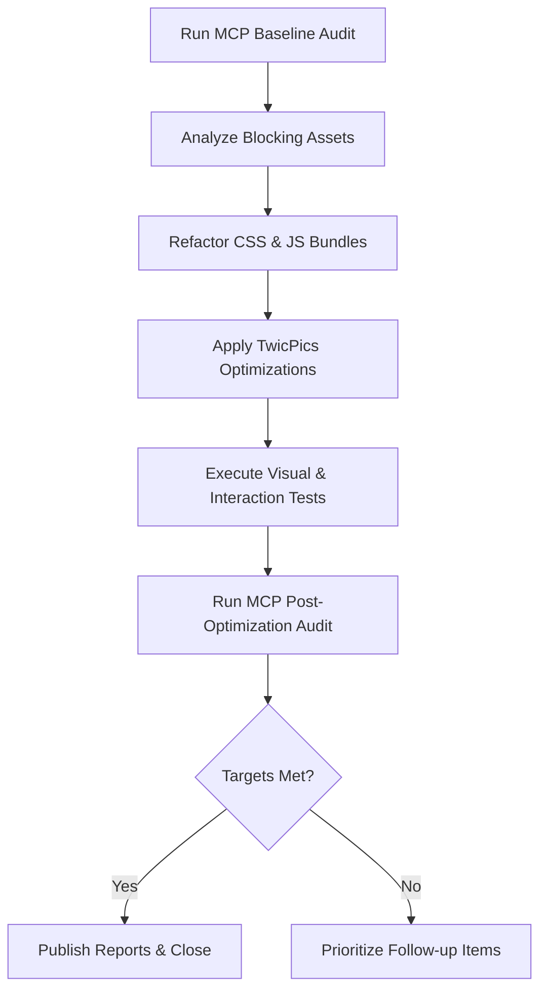

# Design Document

## Overview
This design implements a performance optimization program for the Shopify theme that preserves existing Bulma customizations (`b-` prefix) and Alpine.js interactions while the storefront migrates product media delivery to TwicPics. The solution covers baseline audits, targeted CSS/JS refactors, image optimization aligned with TwicPics, and verification that Core Web Vitals improve without visual or behavioral regressions (Requirements 1–4).

## Architecture
- **Baseline & Regression Measurement (Req 1, Req 4)**
  - Add a headless MCP-driven Playwright script that runs Lighthouse-style probes against key templates (homepage, collection, product). Results persisted as JSON snapshots in `storage/perf-reports/{timestamp}.json` with metrics LCP, CLS, FID, TTFB, and asset waterfall data.
  - Provide npm scripts `perf:baseline` and `perf:compare` to execute tests and diff against prior snapshots.
- **CSS Delivery Optimization (Req 2.1, Req 3.1)**
  - Split `custom-bulma-project.scss` into critical (above-the-fold) and async bundles while migrating to Bulma's module-based `@use` imports so only required components ship. Critical CSS inlined via Liquid in `layout/theme.liquid`, async bundle loaded with `rel="preload"` + `onload` swap, preserving `b-` prefixed classes while leaving native Shopify selectors intact.
  - Document a curated set of Bulma modules for each bundle (utilities, base, navbar, buttons, etc.) and automate verification that no global Bulma import remains, using targeted tests to flag regressions.
- **JavaScript Loading Strategy (Req 2.3, Req 3.2)**
  - Convert `assets/global.js` and other large bundles into ES modules. Use `type="module"` with `defer` and Alpine.js `alpine:init` hooks to ensure component registration occurs before DOMReady. Lazy-load Alpine-dependent sections via `IntersectionObserver` wrappers.
  - Maintain hydration order by emitting a manifest (`storage/js-manifest.json`) that maps dependencies for runtime validation.
- **Media Optimization with TwicPics (Req 2.2, Req 4.1)**
  - Standardize product media Liquid snippets (`snippets/product-media.liquid`) to use `<twic-picture>` tags with responsive presets derived from TwicPics config. Provide fallback `` for noscript.
  - Integrate TwicPics lazy loading thresholds and responsive breakpoints consistent with Bulma grid to keep visual fidelity.
- **Regression Safeguards (Req 3.1, Req 3.3)**
  - Add visual regression suite using Playwright screenshot comparisons (`tests/visual/{template}/{viewport}.png`) triggered post-build.
  - Surface diffs in MCP console and store approvals in Git to provide rollback context.

Mermaid overview of the optimization workflow:


## Components and Interfaces
- **Performance Audit Script (`scripts/perf-audit.js`)**
  - Exposes CLI: `node scripts/perf-audit.js --templates=home,product --output=storage/perf-reports`. Accepts flags for environment URL. Uses MCP to collect metrics and asset blocking details (Req 1.1–1.3).
- **Asset Analyzer (`scripts/analyze-assets.js`)**
  - Consumes audit waterfall JSON, outputs CSV/Markdown summary of blocking CSS/JS, includes third-party tag annotations for mitigation tracking (Req 1.2, Req 1.3).
- **CSS Build Pipeline (Sass + Esbuild)**
  - Adds configuration in `build-bulma` script to output `critical.css` and `async.css`. The build composes Bulma via `@use` module entry points aligned to critical/async bundles, keeping `b-` names intact without relying on post-processing purges (Req 2.1).
- **JS Loader Manifest (`scripts/build-js-manifest.js`)**
  - Generates dependency graph and ensures Alpine.js component definitions (`assets/custom.js`, `assets/quick-add.js`, etc.) load before dependent snippets (Req 2.3).
- **TwicPics Integration Layer (`snippets/twic-media.liquid`)**
  - Wrapper snippet parameterized by media type and breakpoints. Ensures compatibility with ongoing TwicPics migration and includes fallback markup (Req 2.2).
- **Visual Regression Runner (`tests/visual/run.js`)**
  - Playwright-based harness capturing screenshots, comparing to baselines, and flagging diffs with thresholds (Req 3.1–3.3).
- **Reporting Dashboard (`storage/perf-summary.md`)**
  - Markdown summary automatically regenerated with before/after metrics and open follow-ups (Req 4.1–4.3).

## Data Models
- **Performance Report JSON**
  ```json
  {
    "template": "product",
    "timestamp": "2025-01-15T10:00:00Z",
    "metrics": {"LCP": 2.4, "CLS": 0.08, "FID": 18, "TTFB": 0.6},
    "blockingAssets": [
      {"path": "assets/application.css", "type": "css", "impact": "high"},
      {"path": "https://thirdparty.js", "type": "script", "impact": "medium", "owner": "marketing"}
    ]
  }
  ```
- **JS Manifest JSON**
  ```json
  {
    "alpine-core": {"entry": "assets/global.js", "dependsOn": []},
    "component-cart": {"entry": "assets/cart.js", "dependsOn": ["alpine-core"]}
  }
  ```
- **Visual Diff Metadata**
  ```json
  {
    "template": "collection",
    "viewport": "desktop",
    "diffPercentage": 0.7,
    "status": "approved"
  }
  ```

## Error Handling
- Performance scripts retry MCP runs up to three times with exponential backoff; on failure they log diagnostics and mark reports as `status: "incomplete"` (Req 1.1).
- Asset analyzer flags missing files and third-party mitigations, writing actionable warnings into the summary so regressions cannot silently pass (Req 1.2, Req 1.3).
- CSS build pipeline falls back to existing single bundle if critical extraction fails, ensuring the theme still renders correctly (Req 2.1, Req 3.1).
- JS loader manifest validates that Alpine components remain registered; if a dependency is missing, it prevents deployment by failing the build (Req 2.3, Req 3.2).
- TwicPics snippet includes `loading="lazy"` fallback `` tags referencing Shopify CDN assets if TwicPics domain is unreachable, preserving visual coverage (Req 2.2, Req 3.1).
- Visual regression suite halts deployment when diff thresholds exceed limits and supplies rollback instructions aligned with requirement 3.3.

## Testing Strategy
- **Performance Regression Tests**
  - Run `npm run perf:baseline` before optimization and `npm run perf:compare` after changes; ensure >20% LCP and >10% CLS improvements (Req 4.1).
- **Automated Visual Tests**
  - Playwright scripts capture baseline and post-change screenshots for desktop (1440px) and mobile (390px). Diffs beyond 1% trigger manual review (Req 3.1).
- **Interaction Smoke Tests**
  - Use Playwright to trigger Alpine.js components (cart drawer, quick add, predictive search) validating state transitions remain intact (Req 3.2).
- **Build Validation**
  - CI step runs `npm run build-bulma`, `npm run build:css`, and JS manifest generation to confirm `b-` namespace preservation, absence of legacy Bulma global imports, and dependency graph integrity (Req 2.1, Req 2.3).
- **Fallback Coverage**
  - Unit tests for the TwicPics snippet ensure noscript fallbacks emit correct `` markup and proper attribute propagation (Req 2.2, Req 3.1).
- **Reporting Verification**
  - Snapshot tests on `storage/perf-summary.md` confirm documentation includes before/after charts and follow-up recommendations (Req 4.2, Req 4.3).
